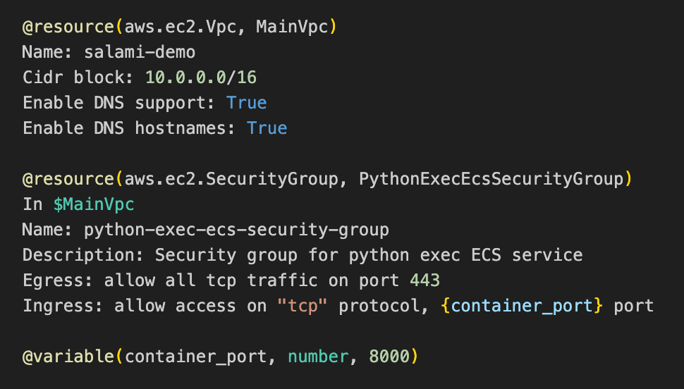

<p align="center">
  
</p>

# Salami

Infrastructure As Natural Language

## 🤔 What is this?

Salami is a declarative domain-specific language for cloud infrastructure based on natural language descriptions. Salami compiler uses GPT4 to convert the natural language to Terraform code. You can think of Salami as writing documentation for each cloud resource object, and letting the compiler take care of converting that to IaC (Infrastructure as Code).

**[Short demo video](https://youtu.be/ej629E0WOIY)** |
**[Release blog post](https://www.petrgazarov.com/posts/infrastructure-as-natural-language)**

## 🚀 Getting Started

### Installation

Homebrew (Mac OS, Linux):

```bash
brew tap petrgazarov/salami
brew install salami
```

Manual:

Download the latest binaries for Mac OS, Linux and Windows from the [releases page](https://github.com/petrgazarov/salami/releases).

### Config

The root of your project should contain a `salami.yaml` config file.

Example:

```yaml
compiler:
  target:
    platform: terraform
  llm:
    provider: openai
    model: gpt4
    api_key: ${OPENAI_API_KEY}
  source_dir: salami
  target_dir: terraform
```

| Configuration Setting       | Description                                                                   | Required |
| --------------------------- | ----------------------------------------------------------------------------- | -------- |
| compiler.target.platform    | Platform to target. Only `terraform` value is currently supported.            | Yes      |
| compiler.llm.provider       | Provider for the LLM. Only `openai` value is currently supported.             | Yes      |
| compiler.llm.model          | Model used by the provider. Only `gpt4` value is currently supported.         | Yes      |
| compiler.llm.api_key        | OpenAI API key. To set it to an env variable, use the `${ENV_VAR}` delimeter. | Yes      |
| compiler.llm.max_concurrent | Maximum number of concurrent API calls to OpenAI API. Default is 5.           | No       |
| compiler.source_dir         | The directory where your Salami files are located.                            | Yes      |
| compiler.target_dir         | The directory where the Terraform files should be written.                    | Yes      |

### Usage

From the root of your project, run:

```bash
salami compile
```

For verbose output, run:

```bash
salami -v compile
```

## 🎨 Design

### Constructs

Salami files are mostly comprised of natural language, with several special constructs:

1. **Blocks** - multiline blocks of text that each represent either a resource or a variable; delimited by double newlines.
2. **Constructor functions** - functions that are used to specify the nature of the block; start with an `@` symbol.
3. **Variable references** - references to variables that are defined in the program; delimited by curly braces.
4. **Resource references** - references to resources that are defined in the program; start with a dollar sign.

<small>Example Salami code with 3 blocks: VPC resource, Security Group resource and the <code>container_port</code> variable:</small>

<p align="center">
  
</p>

For more examples, see the `examples` directory. Each example has a README file with instructions on how to run it.

### Constructor function signatures

<br>

**@resource**

| Position | Argument      | Type   | Required? | Examples                         |
| -------- | ------------- | ------ | --------- | -------------------------------- |
| 1        | resource type | string | Yes       | `aws.s3.bucket`, `AWS S3 Bucket` |
| 2        | logical name  | string | Yes       | `ApiCluster`, `prod_bucket_1`    |

<br>

**@variable**

| Position | Argument      | Type   | Required | Examples                             |
| -------- | ------------- | ------ | -------- | ------------------------------------ |
| 1        | name          | string | Yes      | `container_port`, `logs_bucket_name` |
| 2        | variable type | string | Yes      | `string`, `number`, `boolean`        |
| 3        | default       | any    | No       | `8080`, `logs_bucket_1fdretbnHUdfn`  |

### Lock file

The compiler generates a lock file that includes parsed Salami objects and the resulting Terraform code. It is used to determine which objects have changed since the last compilation. Unchanged objects are not sent to LLM, which makes the compilation process much faster.

### File extension

`.sami` is the extension for Salami files.

## ✅ VS Code Extension

It's recommended to install the [Salami VS Code extension](https://marketplace.visualstudio.com/items?itemName=Salami.salami). It provides highlighting functionality for the `.sami` files.

## 😍 Contributing

Contributions are welcome! For non-trivial contributions, please open an issue first to discuss the proposed changes.
