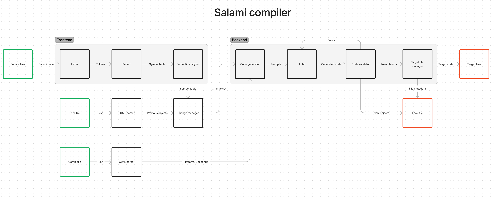

# Architecture

## Compiler

Salami compiler performs the following steps:

1. **Lexing** - converts the input text into a stream of tokens.
2. **Parsing** - converts the stream of tokens into parsed objects.
3. **Semantic analysis** - performs semantic analysis on the parsed objects.
4. **Change set generation** - generates a change set between the previous state and the current state.
5. **Code generation** - generates the target code using LLM.
6. **Code validation** - validates the generated code, sending errors back to LLM and receiving fixed code.
7. **Target file generation** - generates the target files.
8. **Lock file generation** - generates the lock file for the current state.

A simplified diagram of the compiler:

</img>